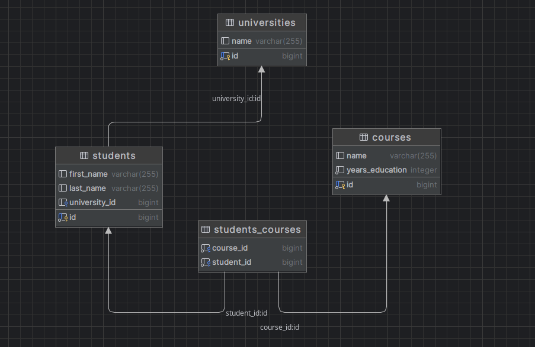

# Academy CRUD REST API

Учебный Spring Boot проект REST API для работы с университетами, студентами и курсами. Проект реализует базовые операции CRUD, поддержку связей многие-ко-многим, DTO-маппинг и пагинацию.

---

## Особенности проекта

- Полный CRUD для University, Student, Course
- Связи:
    - University ↔ Student — one-to-many
    - Student ↔ Course — many-to-many
- DTO для входа и выхода через MapStruct
- Spring Data JPA, Spring Boot, Lombok, PostgreSQL
- Пагинация и сортировка всех списков
- Валидация параметров
- Swagger/OpenAPI для интерактивной документации
- Заполнение БД тестовыми данными через SQL-скрипт
---

## Технологии

- Java 17+
- Spring Boot
- Spring Data JPA
- MapStruct
- Lombok
- PostgreSQL
- Swagger-UI

---

## Структура базы данных

## Эндпоинты

### University

- `GET    /api/universities?page=0&size=10` — список университетов с пагинацией
- `GET    /api/universities/{id}` — получить университет по id
- `POST   /api/universities` — создать университет
- `PUT    /api/universities/{id}` — обновить университет
- `DELETE /api/universities/{id}` — удалить университет
- `GET    /api/universities/{id}/students?page=0&size=10` — получить студентов университета

### Student

- `GET    /api/students?page=0&size=10` — список студентов с пагинацией
- `GET    /api/students/{id}` — получить студента по id
- `POST   /api/students` — создать студента (университет, курсы)
- `PUT    /api/students/{id}` — обновить студента
- `DELETE /api/students/{id}` — удалить студента
- `GET    /api/students/{id}/courses?page=0&size=10` — курсы студента

### Course

- `GET    /api/courses?page=0&size=10` — список курсов с пагинацией
- `GET    /api/courses/{id}` — получить курс по id
- `POST   /api/courses` — создать курс
- `PUT    /api/courses/{id}` — обновить курс
- `DELETE /api/courses/{id}` — удалить курс
- `GET    /api/courses/{id}/students?page=0&size=10` — список студентов на курсе

## Пагинация

Все списковые эндпоинты принимают параметры:

- `page` — номер страницы (от 0, по умолчанию 0)
- `size` — количество элементов (по умолчанию 10)
- `sort` — поле для сортировки, например: `sort=name,asc` (опционально)

